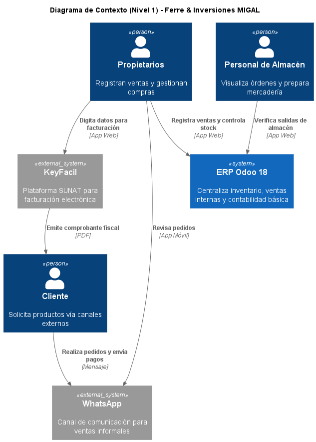
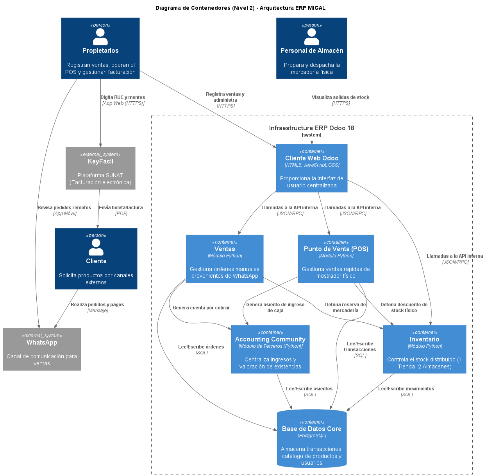
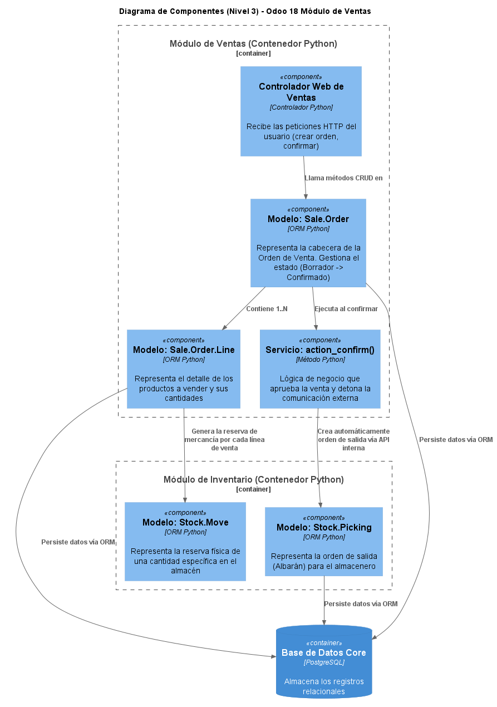
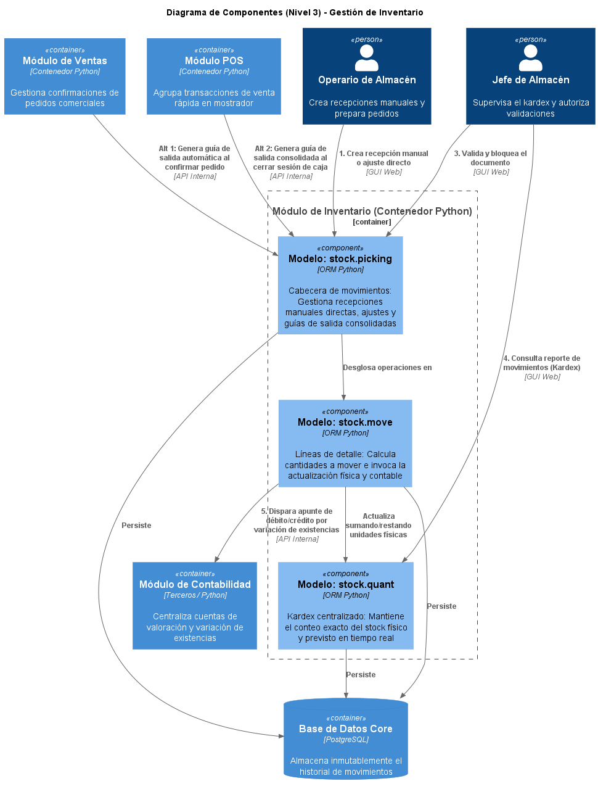

# Arquitectura del Sistema

Para plasmar la arquitectura del sistema ERP de Ferre & Inversiones MIGAL, se ha adoptado el Modelo C4 (Context, Containers, Components, Code)

## 1. Diagrama de Contexto (Nivel 1)

Ofrece la visión más general del sistema. Define los límites arquitectónicos del ERP Odoo 18 y cómo este interactúa con los usuarios clave y los sistemas externos.

---

## 2. Diagrama de Contenedores (Nivel 2)

Expone la infraestructura técnica subyacente. Se visualiza el cliente web, la base de datos centralizada en PostgreSQL, y los contenedores lógicos en Python correspondientes a los módulos seleccionados

---

## 3. Diagramas de Componentes (Nivel 3)

Profundiza en los contenedores específicos para revelar los componentes internos (modelos ORM y controladores lógicos) que ejecutan los flujos de negocio principales.

### 3.1. Flujo Integral de Ventas

Representa la orquestación técnica dentro de los módulos comerciales. Muestra cómo la transición de estado de un pedido desencadena automáticamente operaciones en el inventario y en la contabilidad general, y cómo se gestiona el flujo alternativo de quiebre de stock.

### 3.2. Gestión de Inventario Centralizada

Ilustra cómo el sistema centraliza los movimientos de mercadería provenientes de recepciones manuales, ventas mayoristas y consolidaciones de mostrador (POS), garantizando la integridad de los datos físicos y su correspondiente valoración financiera.

